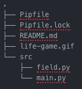

# 2d_cellular_automata
二次元オートマトンをアニメーションできるレポジトリです。

# 使い方
1. 下のコードを用いてコードをダウンロード
`git clone https://github.com/hodaka0714/2d_cellular_automata.git`
2. `cd 2d_cellular_automata` でディレクトリ移動
3. `pipenv run start` で開始。

# 構成

# 結果イメージ
結果のgifイメージは、
`datas_for_readme/life-game.gif` に置いてあります。
